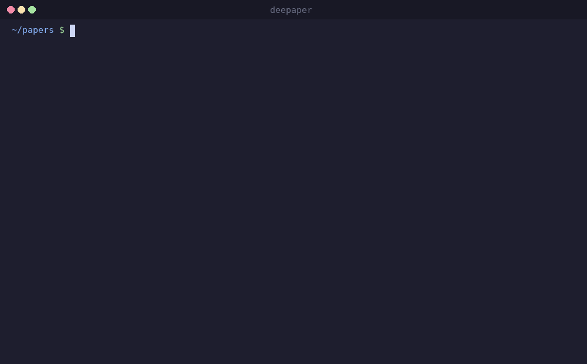

# deepaper

> One arxiv link &rarr; one expert-level deep analysis note, powered by a multi-agent pipeline

[](https://pypi.org/project/deepaper/)
[](https://pypi.org/project/deepaper/)
[](LICENSE)

**English** | **[中文](README_CN.md)**



deepaper turns arxiv paper links into structured deep analysis notes via a **5-agent pipeline** orchestrated by Claude Code. Not summaries -- **actionable research notes**: 7-section expert analysis with 15 automated quality gates, evidence-based mechanism family trees, cross-domain transfer prescriptions, complete hyperparameter tables and pseudocode, and engineering pitfall warnings for reproducers.

Notes are stored as Obsidian-compatible Markdown + YAML, with Git sync, auto-classification (12 subcategories), powered by Claude Code CLI (Max subscription, no API billing).

## How It Works

deepaper runs as a `/deepaper` slash command inside Claude Code. When you type `/deepaper <arxiv-url>`, it orchestrates a 5-agent pipeline:

```
Conductor (Claude Code)
  ├→ [1] Extractor    — reads all pages, outputs structured notes (tables, formulas, related work)
  ├→ [2] Writer-A     — writes frontmatter + executive summary + motivation + methodology      ┐
  ├→ [3] Writer-B     — writes experiments & attribution + critical review                      ├ parallel
  ├→ [4] Writer-C     — writes mechanism transfer analysis + background context                 ┘
  ├→ [5] Critic       — 15 quality gates audit (with inline fallback if API is unavailable)
  └→ [6] Fixer        — patches failed gates (if any)
```

Each agent has specialized prompts, character-count gates, and automated self-checks. The final output passes 15 quality gates covering factual accuracy, data density, and structural completeness.

## deepaper vs Alternatives

| Feature | Zotero | Semantic Scholar | Manual Notes | **deepaper** |
|---------|--------|------------------|-------------|------------|
| **Deep Analysis** | Bookmarks + highlights | Abstract | Hand-written | 7-section multi-agent analysis |
| **Quality Control** | None | None | Self-review | 15 automated quality gates |
| **Mechanism Mapping** | None | None | Yes (time-consuming) | Auto mechanism family tree (ancestors/siblings/descendants) |
| **Citation Tracking** | Count only | Citation list | Manual search | Evidence-based descendants (OpenAlex, no API key) |
| **Obsidian Native** | None | None | Native | Native (YAML + Markdown + Dataview) |
| **Multi-device Sync** | Cloud sync (paid) | None | Git sync (DIY) | Git sync (built-in) |
| **API Cost** | None | None | None | None (Max subscription, no per-token billing) |

## Quick Start

```bash
# Install
pip install deepaper

# Initialize project
cd my-papers && deepaper init

# In Claude Code, analyze a paper
/deepaper https://arxiv.org/abs/2512.13961
```

A markdown note appears in `papers/` -- open it directly in Obsidian.

## Installation

```bash
# Recommended: isolated install
pipx install deepaper

# Or direct install
pip install deepaper

# Install the /deepaper slash command globally
deepaper install
```

> **Prerequisite:** [Claude Code CLI](https://claude.ai/code) installed and authenticated (Max subscription). PyMuPDF is also needed for PDF text extraction: `pip install PyMuPDF`.

## Usage

### Analyze a Paper (Multi-Agent Pipeline)

In any Claude Code session within a deepaper project:

```
/deepaper https://arxiv.org/abs/2512.13961
```

This triggers the full 5-agent pipeline. The Conductor:
1. Downloads the PDF and extracts full text
2. Spawns the Extractor to read all pages and produce structured notes
3. Spawns 3 Writers in parallel to produce the analysis
4. Runs the Critic to verify 15 quality gates
5. Fixes any failed gates
6. Saves to `papers/{category}/{title}.md`

### CLI Commands

```bash
# Download a paper PDF + metadata
deepaper download https://arxiv.org/abs/2512.13961

# Save an analysis to the knowledge base
deepaper save 2512.13961 --category llm/pretraining --input /tmp/analysis.md

# Look up citing papers
deepaper cite 2512.13961

# Update an existing note with citation data
deepaper cite --update 2512.13961

# Sync notes to git
deepaper sync
```

### Citation Lookup

```bash
deepaper cite 1706.03762
```

Fetches real citing papers from OpenAlex (free, no API key needed), sorted by citation count. Use `--update` to inject descendants into an existing note's mechanism family tree.

### Git Sync

```bash
deepaper sync
deepaper sync --message "Add OLMo 3 analysis"
```

Auto-runs `git pull --rebase`, then commits and pushes.

## Analysis Output

Each note contains YAML metadata + 7-section deep analysis, verified by 15 quality gates:

| Section | Content | Quality Gates |
|---------|---------|---------------|
| **Frontmatter** | Baselines (one per line), datasets (with token counts), metrics (with eval config) | Baselines format, metrics config, datasets counts |
| **Executive Summary** | TL;DR with specific numbers + old-vs-new comparison + core mechanism | TL;DR contains ≥2 benchmark numbers |
| **Motivation** | Baseline pain points with numbers + 3-step causal chain + intuitive analogy | Pain points cite ≥2 baselines, causal chain ≥3 steps |
| **Methodology** | Data flow diagram + formulas + numerical walkthrough + pseudocode + hyperparameter tables + design decisions | ≥12K chars, design decisions ≥3K chars |
| **Experiments** | Full comparison tables (all baselines) + ablation ranking + credibility check | ≥2 complete tables, attribution with delta numbers |
| **Critical Review** | Hidden costs with numbers + reusable techniques + pitfalls + related work comparison | ≥3 hidden costs with numbers |
| **Mechanism Transfer** | 3-5 primitives + cross-domain prescriptions + family tree (≥4 ancestors, ≥3 siblings) | ≥5K chars, prescriptions complete, family counts |
| **Background** | External technologies table (≥8 items) | -- |

### Category System

Papers are auto-classified into 12 subcategories:
- **LLM**: pretraining, alignment, reasoning, efficiency, agent
- **RecSys**: matching, ranking, llm-as-rec, generative-rec, system
- **Multimodal**: vlm, generation, understanding
- **Other**: misc

## Obsidian Integration

Open the project root as an Obsidian vault. Use [Dataview](https://github.com/blacksmithgu/obsidian-dataview) to query notes:

```dataview
TABLE date, venue, keywords
FROM "papers"
SORT date DESC
LIMIT 20
```

## Configuration

| Parameter | Default | Description |
|-----------|---------|-------------|
| `git_remote` | -- | GitHub/GitLab remote URL (for `deepaper sync`) |
| `papers_dir` | `papers` | Note storage directory |

Citation analysis uses the [OpenAlex](https://openalex.org/) open API -- **no API key required**.

For richer influence scoring, optionally configure a [Semantic Scholar API key](https://www.semanticscholar.org/product/api#api-key-form) (free) in `config.yaml` or via `SEMANTIC_SCHOLAR_API_KEY` env var.

## Requirements

- Python 3.10+
- [Claude Code](https://claude.ai/code) CLI (installed and authenticated)
- Max subscription (no API billing)
- PyMuPDF (`pip install PyMuPDF`) for PDF text extraction
- Git (optional, for `deepaper sync`)
- Obsidian (optional, for viewing the vault)

## License

AGPL-3.0-or-later. See [LICENSE](LICENSE).
