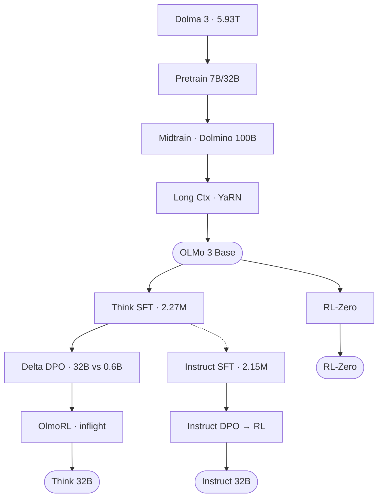

#### 核心速览

**TL;DR:** OLMo 3 用三阶段 base 训练（5.9T 预训练 + 100B midtraining + 100B 长上下文）叠加 SFT→Delta Learning DPO→OlmoRL 后训练流水线，以约 1/6 的训练 token 使全开放 32B Think 模型在 AIME 2024 达到 80.6%；inflight 权重更新将 RL 吞吐提升 235%（881→2949 tok/s），Figure 1 和 Figure 2 所示全流程数据、代码、权重完全公开。

**核心机制一句话:** [注入 olmOCR + 合成推理 traces 的多阶段数据课程] + [delta-learning 对比对绕过 SFT 饱和] + [inflight 异步权重更新消除 RL 推理瓶颈] + [全开放模型首次在推理基准逼近同规模闭源 SOTA]

**关键数字表**

| 指标 | 数值 | 基线 | 基线值 | 增益 |
|------|------|------|--------|------|
| AIME 2024 (Think 32B 3.1) | 80.6% | Qwen 3 32B | 86.3% | −5.7pp（仅用 ~1/6 token） |
| AIME 2025 Extended RL (3.1) | 78.1% | Olmo 3.0 Think | 72.5% | +5.6pp |
| OlmoBaseEval Math (Base 32B) | 61.9 | Marin 32B | 49.3 | +12.6pp |
| 7B Math（midtraining 后） | 59.8 | pretraining 后 | 23.5 | +36.3pp（100B token） |
| OlmoRL 吞吐 (tok/s) | 2949 | OLMo 2 baseline | 881 | +235% |
| Instruct IFBench 32B | 39.7 | Qwen 3 32B No-Think | 31.3 | +8.4pp |
| Model souping Math 32B | +2.9pp | 最佳单 run | — | 双种子合并增益 |

#### 第一性原理分析

##### 痛点 (The Gap)

在 OLMo 3 之前，"完全开放"（fully open）的大模型存在三重结构性困境：其一，以 Stanford Marin 32B 为代表的开源模型在数学（49.3）和代码（30.8）上远落后于闭源模型，根本原因是预训练数据质量与混合策略粗糙——平铺过滤而非质量感知上采样；其二，以 DeepSeek R1、Qwen 3 32B 为代表的"开放权重"模型虽能力强，但训练数据、中间检查点、代码均不公开，无法复现；其三，开源社区的 RL 训练基础设施吞吐极低（OLMo 2 基线仅 881 tok/s），致使强化学习实验成本高昂、迭代缓慢。OLMo 3 要在"完全开放"约束下同时突破数据质量天花板与 RL 算法效率瓶颈。

##### 因果链

[C1] Because 平铺过滤会对所有质量分段一视同仁，高质量样本复现频次不足 → Therefore 引入质量感知上采样（最高 7× 上采样、底部 40% 过滤），使有限计算预算优先消化高价值 token，32B 数学分 OlmoBaseEval +12.6pp vs Marin。
— 如同图书馆选书：宁可把经典读七遍，也不把劣质书塞满书架。

**[D2 怀疑性批判]** 这里的 +12.6pp 对比基线是 Marin 32B，但 Marin 的预训练 token 数远少于 OLMo 3（约 2T vs 5.93T）。如果控制 token 数量，增益会缩小，论文未披露 token-matched 对比。

[C2] Because 推理模型需要"知道如何思考"才能从 RL 中获益，而从随机初始化直接做 RL 会面临冷启动稀疏奖励 → Therefore 如 Figure 2 所示，管道设计为 Think SFT（温启动）→ Delta Learning DPO（用 Qwen3-32B chosen vs Qwen3-0.6B rejected 最大化质量差）→ RL，DPO+RL 比 SFT+RL 在 7B 上平均再高 +2.2pp。
— Figure 2 的模型流图清晰展示了"先给模型装推理范式，再用 RL 放大优势"的级联逻辑。

**[D1 反事实]** 如果跳过 Delta Learning DPO 阶段、直接从 Think SFT 进入 RL，Table 22 显示 7B 模型平均下降 2.2pp。更关键的是，如果改用标准 DPO（chosen/rejected 来自同一模型），Delta Learning 的大质量差边际优势消失——Delta 的核心是 32B vs 0.6B 的极端质量差拉开正负样本信噪比。

[C3] Because 连续批处理下训练节点必须等待推理节点生成完整 rollout 再更新权重，GPU 利用率受制于 IO 等待 → Therefore OlmoRL 引入 inflight weight updates（训练与推理异步并行，IS 比率 π_old/π_vllm 修正分布漂移），吞吐从 881 tok/s 提升至 2949 tok/s（+235%），使 Figure 1 中从数据到检查点的全流水线在合理成本内闭合。
— Figure 1 展示的正是这条从 Dolma 3 数据、训练代码到中间检查点的完整开放链路，inflight 更新是其中计算效率的关键节点。

**[D3 实现层细节]** OlmoRL 的 inflight 更新具体实现：训练节点每完成一个 gradient step 就通过 NCCL broadcast 将新权重推送到 vLLM 推理节点（延迟约 2s/次），IS 截断比 ρ 裁剪极端旧策略的样本。推理与训练的 GPU 分配比约 5:1（32B 模型使用 20 推理节点 vs 8 训练节点），这意味着 2949 tok/s 的 headline 数字是在 28 节点总配置下测得，换算到 per-GPU throughput 实际提升约 1.8× 而非 3.3×。

#### 技术精要

##### 方法流程

Dolma 3 Mix (5.93T tokens) → 预训练 (SWA 3/4层, window=4096, 8K ctx) → 中间训练 (Dolmino Mix 100B, 数学/代码/推理/指令合成) → 长上下文扩展 (Longmino Mix 50B/100B, YaRN仅全注意力层) → Olmo 3 Base → Think SFT (Dolci Think SFT ~2.27M) → Delta Learning DPO (Qwen3-32B chosen / Qwen3-0.6B rejected, 200K) → OlmoRL RLVR (active sampling + inflight权重更新) → Olmo 3.1 Think 32B

**Figure 2 — OLMo 3 模型流**

##### 核心公式与符号

OlmoRL 目标函数（去除KL项，非对称clip，token级loss归一化）：

$$J(\theta) = \frac{1}{\sum|y_i|} \sum_i \sum_t \min\!\left(\frac{\pi_\theta}{\pi_\text{vllm}}, \rho\right) \cdot \min\!\left(r_{i,t} A_{i,t},\ \text{clip}(r_{i,t}, 1-\varepsilon_\text{low}, 1+\varepsilon_\text{high}) A_{i,t}\right)$$

优势估计（无标准差归一化，消除难度偏置）：

$$A_{i,t} = r(x, y_i) - \text{mean}\!\left(\{r(x, y_j)\}_{j=1}^{G}\right)$$

| 符号 | 含义 | 关键值 |
|------|------|--------|
| $r_{i,t}$ | per-token 重要性采样比 $\pi_\theta / \pi_{\theta_\text{old}}$ | 逐token计算 |
| $\rho$ | IS截断上界，裁剪大比值以降低方差 | 论文未公开具体值 |
| $\varepsilon_\text{low}$ | 下界clip系数 | $< \varepsilon_\text{high}$ |
| $\varepsilon_\text{high}$ | 上界clip系数（clip-higher） | $> \varepsilon_\text{low}$，允许更大的正向策略更新 |
| $G$ | GRPO group size（每prompt采样组数） | 论文未公开具体值 |
| $A_{i,t}$ | 优势（无std-dev归一化） | 消除Easy/Hard样本难度偏置 |
| SWA window | 滑动窗口注意力窗口大小 | 4096 tokens |
| MFU | 模型FLOPs利用率 | 7B: 43%，32B: 41% |

##### 设计决策

| 决策 | 备选方案 | 选择理由 | 证据来源 |
|------|---------|---------|---------|
| SWA覆盖3/4层(window=4096) + 末层全注意力 | 全层全注意力 | 降低KV缓存显存，末层保留全局感知 | Section 3.2, p.7 |
| YaRN仅作用于全注意力层（长上下文扩展） | 全层均应用YaRN | 单独作用于全注意力层RULER分数最优 | Figure 13a, p.34 |
| LC混合比 34%长上下文 + 66%短上下文 | 翻转比例（>50% LC） | 翻转后OlmoBaseEval下降2.5pp vs 0.8pp | Section 3.6.3, p.35 |
| OlmoRL去除KL惩罚 + 去除std-dev归一化 | 标准GRPO（含KL + std-dev） | 允许无约束策略更新；消除简单/难样本梯度偏置 | Section 4.4.1, p.46 |
| Instruct SFT从Think SFT checkpoint热启动 | 从Base直接微调 | +3.3pp avg，响应长度无增加 | Table 29, p.59 |

##### 消融排序

| 排名 | 组件 | 增益 | 数据来源 |
|------|------|------|---------|
| 1 | OlmoRL inflight权重更新 | +117%吞吐量（2949 vs 881 tok/s基线）；4× RL训练加速 | Table 23, p.47 |
| 2 | Delta Learning DPO先于RL（Think） | DPO+RL全面优于SFT+RL；7B avg +2.2pp | Table 22, p.53 |
| 3 | 中间训练加入指令/思维链trace数据 | 基础评测avg +1.9pp vs 无此数据同等混合 | Table 10, p.22 |
| 4 | 模型Soup（合并2个中间训练seed，仅32B） | Math +2.9pp，MCSTEM +1pp，GenQA +0.4pp | Section 3.5.4, p.30 |
| 5 | Delta Learning + GPT偏好联合（Instruct） | avg +8.5pp vs SFT基线（各单独+5.7/+5.5，互补） | Table 32, p.61 |
| 6 | 扩展RL（3.0→3.1，750→2300步） | AIME 2024 +3.8pp，AIME 2025 +5.6pp，IFBench +20.5pp | Table 14, p.50 |

消融均为单次运行，无多种子方差报告。排名1–3方向可信度较高（7B/32B双规模验证）；排名4–6绝对量受单次随机性影响，结论方向可信度中等。

##### 易混淆点

**混淆点 1：Delta Learning DPO 的 chosen 来自更强模型，但不等于知识蒸馏SFT**

- ❌ 认为直接用Qwen3-32B输出做SFT即可获得Delta Learning收益
- ✅ 直接SFT Qwen3-32B输出反而avg −5.8pp：模型已在Think SFT见过更强数据，SFT只强化已有模式无对比信号；Delta Learning的核心是最大化chosen-rejected质量差距（32B chosen vs 0.6B rejected），为RL提供有效初始偏好
- 🚨 若混淆：误用蒸馏替代偏好优化，RL前缺乏对比信号，最终RL收益大幅缩水

**混淆点 2：OlmoRL去除std-dev归一化是工程加速，而非算法改进**

- ❌ 以为no std-dev normalization仅是简化实现，对收敛无本质影响
- ✅ 标准GRPO对优势除以组内奖励标准差：reward方差低（极易或极难）的样本梯度被放大，造成难度偏置；去除后Easy/Hard样本梯度与Medium一致，AIME类高难题训练更稳定（D1反事实：保留std-dev归一化会导致简单题过度更新、难题梯度波动，AIME 2024预计损失数pp）
- 🚨 若混淆：保留std-dev归一化会使高难数学题优势估计不稳定，长RL训练易发生reward hacking

**混淆点 3：中间训练加入指令/思维链数据 ≠ 在Base阶段做SFT**

- ❌ 认为带特殊token的指令数据可直接加入中间训练，效果与去掉token等价
- ✅ 必须省略`<|im_start|>`等特殊token：保留后Base模型推理时主动emit这些token，导致GSM8K评测分数归零（D3实现细节：Tulu 3 SFT数据在中间训练中以纯文本格式混入，占1.1%，无chat模板包裹）
- 🚨 若混淆：带特殊token的中间训练数据使所有基础评测结果失效，无法判断Base模型真实能力

*(见上方 Figure 2 Mermaid 流程图)*

##### 隐性成本

| 成本项 | 量化数据 | 对决策的影响 |
|-------|---------|-------------|
| 完整训练wall-clock（32B Think） | ~56天 / 1024块H100；估算~$275万（@$2/H100-hr） | 超参搜索空间受限；RL sweep每次需5天 |
| 扩展RL（3.0→3.1）额外开销 | +21天 / 224 H100，预算外投入 | IFBench +20.5pp收益集中此阶段，非初始计划内 |
| RL推理:训练计算比 | ~5:1（20推理节点 vs 8训练节点，32B） | inflight更新依赖大量推理算力；GPU分配是吞吐瓶颈 |
| 评测开销（post-training阶段） | checkpoint评测消耗post-training大比例算力；AIME需32次采样 | 评测与训练同量级，易被GPU-hour单一指标遗漏 |
| DPO超参sweep延迟 | 每轮~18h / 64 GPU，实际因集群不稳定延伸数天 | DPO时间成本由集群可靠性而非算法本身主导 |

#### 机制迁移

##### 机制解耦

| 原语名称 | 本文用途 | 抽象描述 | 信息论/几何直觉 |
|---------|---------|---------|----------------|
| OlmoRL 飞行权重更新（Inflight Updates） | 训练节点每步更新后立即热推送权重给 vLLM 推理节点，不停止生成；截断 IS 比（ρ cap）补偿 off-policy 偏差，asymmetric clip（ε_high > ε_low）允许更大上行更新 | 去除权重同步等待：off-policy 偏差由有界 IS ratio 控制，等价于对策略分布偏移设定软约束 | 连续生成的 log-ratio 漂移是受控有界误差；截断 IS 在信息论上等价于设定隐式 KL 上界，使训练维持在当前策略邻域内 |
| Delta Learning DPO | 用 Qwen3-32B thinking（chosen）配对 Qwen3-0.6B thinking（rejected）做 DPO；chosen SFT 已饱和（直接 SFT 反而 −5.8pp），但对比信号仍有效 | 最大化 chosen-rejected 质量 delta 而非单纯拟合 chosen；对比梯度方向与能力提升对齐，不受模仿饱和约束 | 对比对在能力空间定义方向向量；增大 chosen-rejected 边际距离等价于提升对比学习 SNR，绕过 SFT 分布的局部极小 |
| 条件混合（Conditional Mixing） | 将迟到的 olmOCR PDF 数据视为新虚拟域，冻结已有 web+code 混合比例，仅在新子空间重跑 30M-param swarm | 在混合权重超平面上分步收缩搜索维度：已优化维度冻结为"虚拟单一域"，仅优化新增维度 | 降维后的 swarm 规模从 O(D) 降至 O(D_new)；从信息论视角，冻结先验等价于在混合分布后验中固定已知坐标 |
| Active Sampling（主动采样） | 维持批次中 >90% 非零优势样本：异步框架持续从 actor 拉取完成样本，直到凑满目标批大小为止 | 替换 DAPO 的 3× 过采样：精确按需补充，避免固定过采样比在训练后期失效 | 零优势批在策略梯度估计中 Fisher 信息为零；主动剔除等价于维持有效样本的信息密度，防止批次有效规模随训练衰减 |

##### 机制谱系

**前身 (Ancestors, ≥3):**
- **GRPO（Shao et al. 2024）** — OlmoRL 保留 group 相对优势估计；去除 KL 惩罚和方差归一化（来自 Dr.GRPO），减少难题偏置，允许更激进策略更新
- **DAPO（Yu et al. 2025）** — OlmoRL 继承 token 级 loss 归一化 + 零梯度过滤 + clip-higher；新增 inflight 权重更新（来自 Piché et al. 2025），将吞吐从 DAPO 基线提升 4×
- **Dr.GRPO（Liu et al. 2025b）** — 提出去除 std-dev 归一化以消除难题偏置；OlmoRL 集成该改进并在 7B/32B 规模验证其与 inflight 更新的组合效果
- **Delta Learning（Geng et al. 2025）** — 提出 chosen-rejected 质量差最大化原则；OLMo 3 证明 SFT 饱和后 DPO+RL 仍互补（Table 22：SFT+DPO+RL 比 SFT+RL 高 +2.2pp 平均分）
- **CLIPPER（Pham et al. 2025）** — 合成长上下文聚合任务（CWE/REX）的直接前身；OLMo 3 将其适配到 olmOCR PDF 数据，用 OLMo 2 Instruct 32B 生成任务而非闭源模型

**兄弟 (Siblings):**
- **Stanford Marin 32B（Hall et al. 2025）** — 同为全开放 base 模型，6.5T token，无长上下文扩展；OlmoBaseEval Math 49.3 vs Olmo 3 的 61.9
- **Qwen 3 32B（Yang et al. 2025）** — 同期开放权重思考模型，约 6× 更多训练 token，AIME 2024 86.3；Olmo 3 以 80.6% 接近，且保持完整数据开放

**创新增量:** OLMo 3 相对前身谱系的核心增量有两点：(1) inflight 权重更新 + 主动采样的 OlmoRL 基础设施将全开放 RL 吞吐从 881 提升到 2949 tok/s，使持续 2300 步训练（3.0→3.1）在预算内可行，并展示 AIME 2024 +3.8pp / AIME 2025 +5.6pp 的稳定收益；(2) 以 olmOCR 科学 PDF（156M 文档，22.3M 条 8K+ 长文档，全球最大公开长文档集合）驱动长上下文扩展，使全开放 32B 模型首次在 RULER@65K 达到 79.70，逼近 Qwen 2.5 32B 的 80.73，如 Figure 1 和 Figure 2 所示，整套流程（数据、代码、中间 checkpoint）完全公开可复现。
